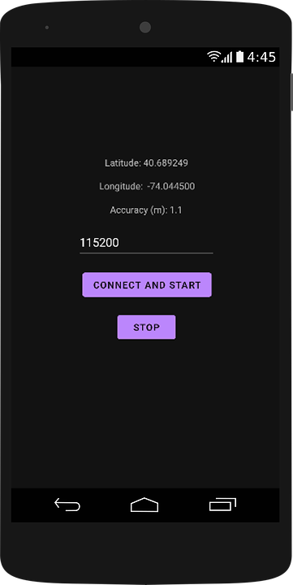

# GPS-to-Serial

Application for sending phone's GPS coordinates via USB serial port. A USB-UART converter is connected to the phone via USB-OTG. On the phone, you need to press the `CONNECT AND START` button, confirm the permissions *(after confirming the permissions, you need to press the button again)* and after that the phone will start receiving GPS coordinates with an interval of **1 second**. Latitude, longitude and accuracy are displayed as text on the layout. Each time new coordinates are received, they are packed into an 11 byte packet and sent to the serial port at the baud rate you **specified before pressing the button**. To stop receiving GPS coordinates and close the serial port, press the `STOP` button.

## Serial packet structure
At the beginning of the packet, 4 bytes are assigned to latitude, 4 to longitude. Then 1 byte of the XOR check-sum (XOR check-sum is calculated using 8 bytes of latitude and longitude), at the end 2 bytes of the packet ending: 0xEE and 0xEF.

**Latitude and longitude values are signed integers.** 6 decimal places (from degrees) are converted to 6 integer digits. (-90000000 to 90000000 for latitude and -180000000 to 180000000 for longitude)

**Latitude and longitude bytes are in Big-endian order.**

Packet structure:
- byte 0-3: latitude bytes in big-endian order (-90000000 to 90000000)
- byte 4-7: longitude bytes in big-endian order (-180000000 to 180000000)
- byte 8: XOR chech-sum of 0-7 bytes
- byte 9: 0xEE
- byte 10: 0xEF
